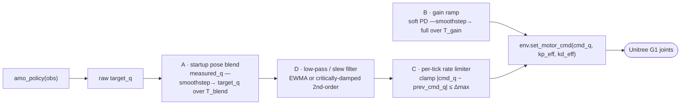

# Plan — AMO policy inference with a joint-smoothing filter

## Goal

Run the RoboJuDo **AMO RL gait** on the real Unitree G1 from inside the
`amo_policy` container, and — critically — **never let the joints snap to the
policy's reference pose at activation**. When the policy is first triggered, its
action head immediately outputs target joint positions that can be far from the
robot's current measured posture. Commanding those directly against full PD
gains makes the joints jump to the reference in a single control tick: a violent
motion that can trip the robot or damage hardware.

The fix is a **dynamics filter on the path from policy output to motor command**:
the commanded joint targets must *converge smoothly* to the AMO reference
instead of stepping to it.

## The problem, precisely

Per control tick (50 Hz) the inference loop does:

```
obs        = build_observation(env_data, command)   # IMU, dof_pos/vel, command, …
action     = amo_policy(obs)                         # torch jit forward pass
target_q   = default_pos + action_scale * action     # reference joint positions
env.set_motor_cmd(target_q, kp, kd)                  # PD targets sent over DDS
```

At t=0 the very first `target_q` is the policy's standing/locomotion reference.
`measured_q` (the captured hand-off posture) can differ by tens of degrees on
several joints. Sending `target_q` straight through means
`error = target_q − measured_q` is large *and* gains are full → torque spike →
snap.

## Design: a layered smoothing filter

The smoothing is applied as a **post-policy filter stage** between the policy
forward pass and `env.set_motor_cmd`. It has four cooperating layers, ordered
from coarse (startup-only) to always-on:



Layers **A–C already exist** in `policy/activation_utils.py` (proven on the
robot, unit-tested in `policy/test_activation_helpers.py`, documented in
`documentation/G1_SAFE_INITIAL_STATE.md`). This plan **reuses them** and adds
layer **D** as an always-on running filter so the smoothing is not only a
startup concern but also damps any abrupt policy output mid-run.

### Layer A — startup pose blend (`blend_pose`, `smoothstep`)

At activation, capture `measured_q = env.dof_pos`. For the first `T_blend`
seconds, command

```
cmd_q = (1 − s)·measured_q + s·reference_q,   s = smoothstep(elapsed / T_blend)
```

`smoothstep(a) = a²(3 − 2a)` has **zero slope at both ends**, so commanded joint
*velocity* starts and ends at zero — no step in velocity at the ramp edges. This
walks the robot from "where it is" to "where the policy wants it" over seconds,
not one tick. Default `T_blend ≈ 5 s`.

> During the blend, the AMO policy can either be held at a zero command (pure
> pose move to the standing reference) or run live with its output used as the
> blend target. Start with the former (simpler, matches the existing staged
> startup), then enable live blending once stable.

### Layer B — PD gain ramp (`gain_ramp_scale`)

Concurrent with A, ramp the PD gains from a **soft** fraction up to full:

```
kp_eff = kp_full · gain_ramp_scale(elapsed, T_gain, kp_start)   # e.g. kp_start = 0.15
kd_eff = kd_full · gain_ramp_scale(elapsed, T_gain, kd_start)   # e.g. kd_start = 0.50
```

Even with a residual pose error during the blend, soft gains keep the corrective
torque small. Defaults `T_gain ≈ 2 s`, `kp_start = 0.15`, `kd_start = 0.50`.

### Layer C — per-tick rate limiter (`clamp_step_delta`)

A hard safety rail applied **last**, regardless of which layer produced the
target:

```
cmd_q = clamp_step_delta(prev_cmd_q, cmd_q, Δmax)   # |cmd_q − prev_cmd_q| ≤ Δmax per joint
```

This caps the per-joint change per control tick so a bad target — from a glitchy
observation, a NaN, or a large blend step — can never snap a joint. With
Δmax ≈ 0.05 rad at 50 Hz that bounds joint speed to ~2.5 rad/s. This is a
*clamp*, not a filter: it only acts when the step is too big.

### Layer D — always-on slew / low-pass filter (NEW)

Layers A–C handle the startup transient. Layer D is the **running dynamics
filter** the user asked for: a smoothing that is active for the *whole* episode
so that even mid-run the commanded joints converge to the policy reference
rather than tracking it instantaneously. Two interchangeable implementations,
selectable by config:

1. **First-order EWMA (exponential low-pass)** — simplest:
   ```
   cmd_q = (1 − α)·prev_cmd_q + α·target_q,   α = dt / (tau + dt)
   ```
   `tau` is the smoothing time constant (e.g. 0.05–0.15 s). Larger `tau` →
   smoother but laggier. One state vector (`prev_cmd_q`), trivially cheap.

2. **Critically-damped second-order filter** (recommended for gait quality) —
   tracks both position and velocity so there is no velocity discontinuity, the
   way a well-behaved reference generator should:
   ```
   # per tick, given natural frequency wn (rad/s):
   a       = wn·wn·(target_q − cmd_q) − 2·wn·cmd_qd
   cmd_qd += a·dt
   cmd_q  += cmd_qd·dt
   ```
   `wn` sets the bandwidth (e.g. 8–15 rad/s); critically damped (ζ=1) means no
   overshoot. This is the standard "smooth-tracking reference filter" and avoids
   the lag-vs-jerk trade-off of the first-order version.

Layer D is applied **before** the rate limiter (C), so C remains the final hard
cap. During startup, D's state is seeded from `measured_q` so it too begins at
the current posture.

## Filter ordering (final)

```
target_q       = default_pos + action_scale · amo_policy(obs)     # raw reference
target_q       = blend_pose(measured_q, target_q, s)              # A (startup only)
target_q       = slew_filter.step(target_q)                       # D (always on)
cmd_q          = clamp_step_delta(prev_cmd_q, target_q, Δmax)     # C (safety cap)
kp_eff, kd_eff = ramp_gains(elapsed)                              # B (startup only)
env.set_motor_cmd(cmd_q, kp_eff, kd_eff)
prev_cmd_q     = cmd_q
```

## Module layout (implemented)

The filter math is **dependency-free** (numpy only) so it unit-tests without a
robot or the heavy RoboJuDo/DDS imports.

```
Navigation/amo/
  activation_utils.py   # layers A/B/C math: smoothstep, blend_pose,
                        #   gain_ramp_scale, command_ramp_factor, clamp_step_delta
  joint_filters.py      # layer D: EWMAFilter, CriticallyDampedFilter, make_filter,
                        #   and JointSmoother (composes A→D→C + B gain scales)
  amo_policy.py         # AMO code: RoboJuDo AMOPolicy + UnitreeEnv wrapper
                        #   (joint maps, 29-DoF PD target, DDS publish)
  amo_inference.py      # driver: ties AMO code + smoothing together; 50 Hz loop,
                        #   staged activation, safety guard, command source
  tests/
    test_joint_filters.py  # step response, no-overshoot, converges to ref,
                           #   bounded velocity, seeding from measured_q, clamp
Navigation/docker/config/amo_g1.yaml  # tunables for all of the above
```

The smoothing (`joint_filters.py` / `activation_utils.py`) is decoupled from the
AMO/RoboJuDo code (`amo_policy.py`); `amo_inference.py` is where they are wired
together at the `env.step(pd_target)` boundary.

## Configuration (CLI flags / env)

Follow the existing convention (argparse flag + `start.sh` env var):

| Flag | Env | Default | Meaning |
|---|---|---|---|
| `--activation_duration_s` | `ACTIVATION_DURATION_S` | 5.0 | Layer A blend time `T_blend` |
| `--activation_gain_ramp_s` | `ACTIVATION_GAIN_RAMP_S` | 2.0 | Layer B gain ramp `T_gain` |
| `--activation_kp_scale_start` | `ACTIVATION_KP_SCALE_START` | 0.15 | Layer B soft kp fraction |
| `--activation_kd_scale_start` | `ACTIVATION_KD_SCALE_START` | 0.50 | Layer B soft kd fraction |
| `--joint_clamp_delta` | `JOINT_CLAMP_DELTA` | 0.05 | Layer C Δmax (rad/tick) |
| `--joint_filter` | `JOINT_FILTER` | `critdamp` | Layer D type: `none`/`ewma`/`critdamp` |
| `--joint_filter_tau` | `JOINT_FILTER_TAU` | 0.08 | Layer D EWMA time constant (s) |
| `--joint_filter_wn` | `JOINT_FILTER_WN` | 12.0 | Layer D crit-damp natural freq (rad/s) |

## Validation

1. **Unit tests** (`test_joint_filters.py`): step input from A to B converges
   monotonically (no overshoot for crit-damp), commanded velocity is bounded,
   filter seeded at `measured_q` outputs `measured_q` on tick 0.
2. **`--observe_only`**: run the full loop with motor publishing disabled; log
   `target_q`, filtered `cmd_q`, and `cmd_q − measured_q` to confirm the first
   commanded delta is ~0 and grows smoothly.
3. **`--stand_only`** on the robot: trigger activation, confirm no audible/visible
   snap and that joints reach the reference over `T_blend`, not instantly.
4. Plot the post-run telemetry (commanded vs. measured joint trajectories) and
   verify the bandwidth/lag is acceptable for the gait before enabling walking.

## Risks & notes

- **Lag vs. gait stability.** Too much layer-D smoothing (large `tau` / small
  `wn`) delays the policy's foot placement and can destabilise the gait. Tune on
  the robot starting from light smoothing; the gait was trained expecting near-
  instant tracking, so D should be a *transient smoother*, not a heavy filter.
- **Filter only the startup, or always?** If always-on smoothing degrades the
  gait, restrict layer D to a fade-out window after activation (blend the filter
  strength to zero over the first few seconds via `command_ramp_factor`), so the
  policy regains full bandwidth once standing.
- **Don't double-count damping.** The PD `kd` term already damps; an aggressive
  layer-D plus high `kd` can feel sluggish. Tune them together.
- This reuses the proven A–C machinery from `G1_SAFE_INITIAL_STATE.md`; the new
  work is layer D and its tests. Keep the math in `joint_filters.py` pure.
