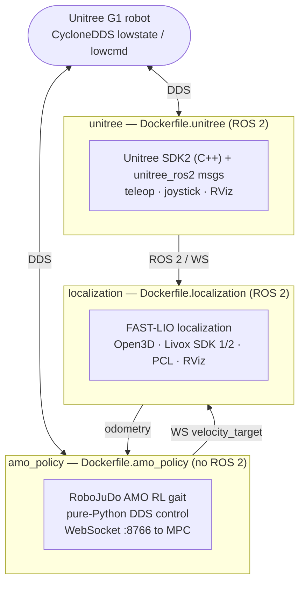

# Docker framework — `Navigation/docker/`

The Navigation stack is split into **three independent container images**, one
per concern. They are deliberately decoupled: each can be built, run, and
debugged on its own, and they communicate at run time over **CycloneDDS** (the
robot bus) and ROS 2 topics — never by sharing a Python environment. This keeps
the heavy, conflicting dependency sets (ROS 2 + Open3D vs. RoboJuDo + torch vs.
Unitree SDK) out of each other's way.



## The three images at a glance

| Image | Dockerfile | Base | Purpose | ROS 2? |
|---|---|---|---|---|
| **unitree** | `Dockerfile.unitree` | `ros:humble-desktop` | Unitree SDK2 (C++) + `unitree_ros2` message packages, CycloneDDS, teleop, joystick, RViz. The ROS 2 ↔ robot bridge layer. | ✅ |
| **localization** | `Dockerfile.localization` | `ros:humble-desktop` | FAST-LIO LiDAR-inertial localization for the MID-360: Open3D 0.14.1 (from source), Livox-SDK + Livox-SDK2, PCL, plus the `FAST_LIO_LOCALIZATION_HUMANOID` workspace. | ✅ |
| **amo_policy** | `Dockerfile.amo_policy` | `python:3.11-slim-bookworm` | The RoboJuDo **AMO RL gait** that actually drives the joints, via `real_g1_walking_policy.py`. Pure Python over CycloneDDS — **no ROS 2**. | ❌ |

## Shared conventions

All three honour the same DDS knobs so they can be wired together identically:

- **`UNITREE_NET_IFACE`** — the NIC CycloneDDS binds to (default `lo`; set to
  e.g. `eth0` to reach the robot). The `unitree` and `amo_policy` images build
  `CYCLONEDDS_URI` from it **in their entrypoint** so it can be changed at
  `docker run` time without rebuilding.
- **`RMW_IMPLEMENTATION=rmw_cyclonedds_cpp`** and **`ROS_DOMAIN_ID`** — set in
  the two ROS 2 images so the ROS middleware and the raw DDS traffic share one
  transport. (Not set in `amo_policy`: it uses CycloneDDS directly, not via the
  ROS rmw layer.)
- **Host networking + IPC** at run time (`--network host --ipc host`) so DDS
  multicast discovery and shared-memory transport reach the robot.
- Source/workspaces are **bind-mounted at run time**, not copied at build time,
  so you can iterate on code without rebuilding the image.

## 1. `Dockerfile.unitree` — robot bus + teleop

`ros:humble-desktop` base. Builds and installs:

- **Unitree SDK2** (C++) from source → `/opt/unitree_sdk2`.
- **`unitree_ros2`**: the `cyclonedds_ws` and `example` colcon workspaces under
  `/opt/unitree_ros2`, providing the Unitree message types and examples.
- ROS 2 tooling for driving the robot by hand: `teleop_twist_keyboard`, `joy`,
  `joy_teleop`, `robot_state_publisher`, `xacro`, `rviz2`, TF tools.

Entrypoint (`unitree_entrypoint.sh`) synthesises `CYCLONEDDS_URI` from
`UNITREE_NET_IFACE`, then sources ROS 2 + both Unitree workspaces.

> Note: this image installs the **C++** SDK and the ROS 2 message packages. The
> **Python** binding `unitree_sdk2py` needed by the AMO policy is *not* here —
> it lives in the `amo_policy` image, which talks to the robot directly.

## 2. `Dockerfile.localization` — FAST-LIO mapping/localization

`ros:humble-desktop` base. The heavyweight build:

- **Open3D 0.14.1** compiled from source to `/opt/open3d-0.14.1` (GUI/CUDA/
  Python module off; uses system Eigen/GLEW/GLFW/qhull). Exposes `Open3D_DIR`,
  `CMAKE_PREFIX_PATH`, `LD_LIBRARY_PATH`. **Baked into the image.**
- **Livox-SDK** and **Livox-SDK2** from source (MID-360 driver dependencies).
  **Baked into the image** (installed libs in `/usr/local`; `LIVOX_SDK2_ROOT`
  points the driver build at them). These are build-once C libraries, not edited.
- PCL, OpenCV, glog/gflags, and the ROS 2 perception stack (`pcl_ros`,
  `cv_bridge`, `image_transport`, message packages, `rviz2`).

The ROS 2 workspace is **not** baked in — it is a locally-editable checkout at
[`../ros2_ws/`](../ros2_ws/), bind-mounted to `/ws` by the compose file, and
built **inside the container** with the bundled `build_ws` helper. It holds both
the `FAST_LIO_LOCALIZATION_HUMANOID` localization packages and the
`livox_ros_driver2` MID-360 ROS 2 driver (with the tuned `MID360_config.json`);
the driver links against the baked-in Livox-SDK2. `build_ws` runs rosdep +
colcon, pointing CMake at the image's Open3D and selecting the driver's ROS 2
build (`-DROS_EDITION=ROS2`):

```bash
cd Navigation/docker
docker compose run --rm localization bash
# inside the container, first time only:
build_ws            # rosdep install + colcon build --symlink-install
```

`build/`, `install/`, and `log/` are written back to the host under `ros2_ws/`
(git-ignored). New shells auto-source `/ws/install/setup.bash` once it exists.
The Open3D path hard-coded in `open3d_loc/CMakeLists.txt` is patched in the local
checkout to `/opt/open3d-0.14.1/...`.

This is the perception/state-estimation image; it publishes the odometry the
planner and AMO policy consume.

## 3. `Dockerfile.amo_policy` — RoboJuDo AMO gait

`python:3.11-slim-bookworm` base — **not** a ROS 2 image. The AMO policy
(`policy/real_g1_walking_policy.py`) is pure Python and talks to the robot
directly over CycloneDDS via `unitree_sdk2py` (see `policy/README.md`). The
image bundles:

- **Python 3.11** — RoboJuDo requires `python >= 3.11`.
- A **CPU build of torch** (the deployment box has no CUDA).
- **RoboJuDo's runtime deps** (`scipy`, `onnxruntime`, `mujoco`, `pydantic`,
  `python-box`, `msgpack`/`msgpack-numpy`, `colorlog`, …) plus `websockets`
  for the policy's `:8766` state/command server. `mujoco` is **mandatory**:
  `G1RealEnvCfg.update_with_fk=True` makes RoboJuDo's `MujocoKinematics` a hard
  requirement, not an optional viewer.
- **Eclipse Cyclone DDS** C library built from source (`releases/0.10.x`) — the
  `cyclonedds==0.10.2` Python binding pulled in by `unitree_sdk2py` is a source
  dist that needs the matching C library present first. Installed to
  `/usr/local`; `CYCLONEDDS_HOME` points the binding at it.
- **`unitree_sdk2py`** from GitHub (`unitree_sdk2_python`), with two upstream
  packaging bugs worked around at build time:
  1. robot-family subpackages (`b2`, `g1`, `h1`, `h2`, `comm`) ship without
     `__init__.py` — they get touched so `from . import b2` resolves.
  2. `setup.py` omits `package_data`, so the CRC native `.so`s are copied into
     site-packages manually; otherwise `CRC().Crc()` fails at `send_cmd` time.

A build-time **import smoke test** imports every critical module and
instantiates `CRC()` (whose native lib loads lazily) so packaging failures
surface at build, not on the robot.

Entrypoint (`amo_entrypoint.sh`):

- builds `CYCLONEDDS_URI` from `UNITREE_NET_IFACE` unless one is already set
  (e.g. a mounted `cyclonedds.xml`);
- adds `ROBOJUDO_ROOT` (default `/workspace/policy/RoboJuDo`) to `PYTHONPATH`;
- runs `POLICY_SCRIPT` (default `/workspace/policy/real_g1_walking_policy.py`),
  forwarding any args; a bare command (e.g. `bash`) is run as-is instead.

### Build & run

```bash
# from Navigation/
docker build -t g1-amo-policy:latest -f docker/Dockerfile.amo_policy docker/

docker run --rm -it --network host --ipc host \
    -e UNITREE_NET_IFACE=eth0 \
    -v "$PWD":/workspace:rw \
    g1-amo-policy:latest --observe_only
```

> `policy/RoboJuDo` is a symlink to the RoboJuDo checkout. Make sure the real
> directory is mounted into the container (mount the parent that resolves the
> symlink, or bind-mount the RoboJuDo checkout to `ROBOJUDO_ROOT` explicitly).

## Why three images, not one

RoboJuDo wants Python 3.11 and a specific torch/mujoco/cyclonedds stack;
FAST-LIO wants a from-source Open3D and PCL against ROS 2 Humble (Python 3.10);
the Unitree bridge wants the C++ SDK and `unitree_ros2`. Forcing these into one
image creates version conflicts (notably the Python 3.10 vs 3.11 split) and a
giant, slow-to-build image. Splitting by concern keeps each build reproducible
and lets you restart just the layer you're iterating on.
